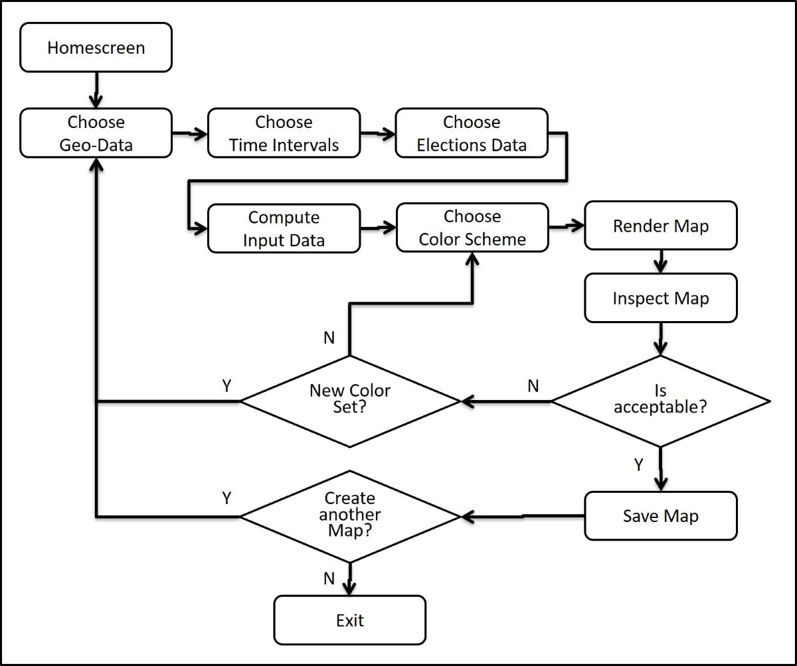

# ISE521FINALPRJ_HTA

# NOTES: (this will be removed before final presentation)
I going to try to organize/structure everything for our final presentation and outline everything here (https://github.com/james-houghton/ISE521FINALPRJ_HTA/blob/master/README.md). The binder_version branch of this repo will be used to continue implementing the Basic_example. This version will (eventually) outline each section and include placeholders with descriptions of the content that will eventually go there. Continue to use the binder_version branch (for coding and link to lauch Binder) and I can move content over incrementally once it is working/finished.

I will also try to add note to the Basic_Example notebook so take a look and et me know anything if there are any major changes that need to be made or if you have any questions, comments, concerns.

File Descriptions:
name and one sentence summary of what it does

Begin Final Paper

# Hierarchical Task Analysis for Choropleth Map Design Process

[]  

Launch Binder Repository using Binder icon on the left or the following link [link here]  

- JH to create new binder and place icon here. the Binder icon at the top of this document is still connected the the binder_version

### Choropleth map

>Place Choropleth map here

This repository and associated Binder{thingy) were prepared by G. Aiello, F. Groß, and J. Houghton

#### Introduction:
Hierarchical Task Analysis (HTA) was first introduced by Annett and Duncan in 1967 (Annett & Duncan, 1967) and has been developed since then. It is known to be the best task analysis according to Kirwan & Ainsworth (1992). One of the most influential ideas for HTA rose in the 1950s. Especially the identification of error variance in system performance from systems theory was a crucial influence (Chapanis, 1951). Annett (2004) stated that the top-down systems approach that HTA uses, enables analysts to identify and deal with factors that generate the largest error variance. Most of the development of HTA in further years concentrated on the need for greater understanding of cognitive tasks (Annett, 2004). At the time HTA was originally developed, existing approaches to structure tasks tended to focus on observable aspects of performance while HTA sought to represent system goals and plans. That was a radical departure from contemporary approaches. HTA offered a way to describe a system in terms of goals and sub-goals, with feedback loops in a nested hierarchy (Stanton, 2006).
HTA belongs to a category of task description methods that focus on crucial aspects of the task within the context of the overall task (Kirwan & Ainsworth, 1992). The basic hierarchy therefore represents a system without control that is influenced from above (authoritarian) or below (delegatory) (Shepherd, 2000). This make the approach goal oriented instead of action-oriented (Annett & Stanton, 2000).

#### Literature Review:

Applications of HTA are observable in many different areas because of the approach’s variety and adaptability. The method’s success in these areas can be put down to two key findings. On the one hand, the approach is inherently flexible. Users are able to describe mostly any system. Astley and Stammers (1987) state that HTA has been used for decades in order to describe generations of major technological systems. On the other hand, the approach is driven by high applicability. Personal specifications, training requirements, error prediction, team performance assessment and system design are possible areas of application (Stanton, 2006).  Especially popular applications took place in training design, interface design and job design (Piso, 1981; Hodgkinson & Crawshaw, 1985; Bruseberg & Shepherd, 1997). Noticeable should be that this does not conclude that the application is easy. Even though there are only a few rules, it requires experience and skills acquired under expert guidance to apply it effectively (Stanton & Young, 1999).
Of special relevance in this paper is the application of HTA in software design. Bellotti (1990) for example used HTA to model situations within the field of human-computer interaction including the computer interface. Because of previously mentioned characteristics HTA is easy to implement into software design methodologies (Mills 1998), which may account for increasing use in the area of system’s design. In Mills (2007) a detailed discussion of advantages and disadvantages can be found. The most relevant advantage for software design is stated by Kirwan and Ainsworth (1992). It says that HTA offers two distinct training benefits to people engaged in the analysis. First, the analysts can gain insight into processes and procedures that are entailed in plants and organizations. Secondly, training benefits users since they are required to articulate their understanding of the system itself. The point is that by doing the actual HTA the developers acquire deeper understanding of their system which in fact is crucial if the resulting system is supposed to function well.
Integration Test / Unit Test
When developing software it is of fundamental importance to test it. The main purpose of testing is to reveal defects. Defect detection capabilities vary with the applied testing methods (Trautsch, 2020). Two important testing methods are unit testing and integration testing. The IEEE standard ISO/IEC/IEEE 24765-2010 (IEEE, 2010) defines the most important vocabulary for software engineering. It defines a unit as a separately testable element specified in the design of a computer software component. It is a logically separable part that is not subdivided into other components. Unit tests are tests of individual hardware or software units or groups of related items. Integration testing relates to the progressive linking and testing of programs or modules in order to ensure their proper functioning in the complete system. Typically unit tests would be performed prior to testing the overall system with integration tests even though some authors argue about the sequential arrangement of these procedures (Shahabuddin, 2017). Some of the given definitions might be outdated due to rapid developments in modern software development contexts (Trautsch, 2020). Anyway, an overall understanding of the developed system is required in order to design good tests that allow successful applications. HTA as previously described is a method that makes developers acquire the relevant deep understanding which reveals possible synergies in the development process.
HTA Procedure
The first paper to lay out approaches for conducting HTA was Annett et al. (1971). It states that the methodology is based upon a theory of human performance. Shepherd (2000) added that it can be regarded as a model of human behavior. As a lack of more information about the human operations can be dangerous, it is critical to follow some kind of guidance. There are three main principles governing the analysis (Annett et al., 1971):
1.	At the highest level of hierarchy a task is considered to be consisting of an operation. This operation is defined in terms of its goal. The goal describes the overall objective of the system in terms of applicable criteria.
2.	Operations can be broken down into sub-operations. Each of them is defined by a sub-goal which describes the contribution to the overall system’s goal. It is therefore measurable by performance standards and criteria.
3.	The relationship between operations and sub-operations is one of inclusion which means it is a hierarchical relationship.

These principles have not changed over the past years.
A procedure for development of the sub-goal hierarchy with the plans is presented in Stanton (2006) in Figure XY. It offers a useful heuristic for breaking the tasks down into a sub-goal hierarchy. This process is of iterative nature and provides a systematic approach for the construction of an HTA structure through repetitive checks. The underlying basic heuristics can be defined as:

-	Describing the system goals and sub-goals
-	Trying to keep the number of immediate sub-goals under any sub-ordinate goal to a small number (i.e., between 3 and 10)
-	Linking goals to sub-goals, and describe the conditions under which sub-goals are triggered
-	Stop re-describing the sub-goals when you judge the analysis is fit-for-purpose

>

#### HTA Procedure:

The Hierarchical Task Analysis framework is applied to define a generalized task sequence while simultaneously documenting the Task Flow and Information Processing Requirements inherent to a Choropleth mapping activity. Stanton's (2006) procedure for identifying sub-goal hierarchies and process plans is applied at the top level first. Then at naively assuming that the initial states of systems are under human control(or supervision) a "clairvoyant" approach inspired by Belady's algorithm is used to identify a fixed set of tasks fixed set of tasks whose process plans all terminate in the same state as the task began.

The test-operate-test-exit (TOTE) procedure (Miller ref in HTA paper) was explored at various sub-levels and task sequencing plans to observe the information processing tasks requirements. The purpose of this exercise was to develop an understanding of where opportunities exist for automating task functions to increase process efficiency without jeopardizing the generalizability or extensibility of the Choropleth mapping activity code.

> HTA here

1. Define Task Under Analysis
  - To create a data visualization tool for voter density data of a state(s) (Rhode Island) to infer voter arrival trends  (Why used → make repeatable, sub-goals, organize tasks, challenges, relevance in that context → goal to understand what needs to be done).

2. Data Collection Process
  - Automatic data collection is part of voting process, by digital check in process
  - Some states do not use a digital voting system

3. Determine overall Goal of the Task
  - Visually represent arrival patterns given user specific defined variables by creating an interactive web application for the generation of maps

4. Sub Goal of the task
  -implement a basic HTA example that defines a standardized, repeatable process for creating a Choropleth map
  -   Geo-data (adding data)
  -   Election data
  -   Style characteristics
  -   Adjustments

5. Sub-Goal Decomposition
  - introduce the basic example and what is in the notebook.

6. Plans Analysis
  - we created the basic example to understand the Task Hierarchy and Flow in order to gain a better understanding of the task requirements and feasable sequencing options.   

7. Stopping Rules

> HTA Basic Example Diagram
>

Problem statement and Basic_Example.ipynb implementation

https://github.com/james-houghton/ISE521FINALPRJ_HTA/blob/master/HTA_test0.html/
